# Bravo's Bold Barbershop

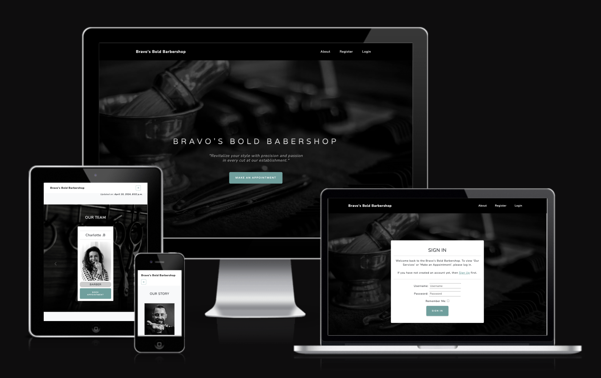

The live link can be found [Bravo's Bold Barbershop!](https://bravos-bold-barbershop-c6f1277863c4.herokuapp.com/)

## Introduction
Bravo's Bold Barbershop is a data-driven website for the 'Bravo's Bold Barbershop'. The site has multiple purposes, as a site it provides insight to the barbershop itself and those who work there. It also takes on the responsibility of booking online appointments. The site is targeted towards users who like to know more information about the establishment and to become a member of ‘Bravo’s Bold Barbershop’ to book one of the many services the barbershop provides. Bravo himself wishes to advertise his barbershop freely with up-to-date information and staff as well as to have the ability to take online appointments to a particular work schedule.

## Planning

In this section, you will find resources which help with the creation of the project. As a note, some aspects of the planning have been altered to the current version of the site. As there have been changes in the scope of the project as well as the look of the project. 

### User Stories

Within this project, there were three main types of users to consider; a non-logged-in user, a logged-in site user, and the site admin/owner of the site.

#### Main User Goals

Non-logged-in User: The main goal for non-logged-in users is to navigate through an attractive and interactive website. With key and relevant information about the establishment. Such as, about the barbershop, about the team they have, and even creating personalized requests to the site owner. Another aspect is being able to become a logged-in user, simply and easily.

Logged-in User: The main goal for a logged-in user is to able to have the same access as the non-logged-in users but more. As a logged-in user, the goal is to able to have access to the the services the barber provides at what prices. As well as being able to create an appointment to my needs. In addition to this being able to delete and update my appointments.

Site Admin / Site Owner: The main goal for the site owner is accessible and able to have control over every aspect of the site. A site would like to add personnel to the site to provide a clear representation of the staff working there. As well as being able to write an about section which can be updated at any time. Another key aspect is the ability to receive hair requests as well. Another aspect which an owner can update is the services they provide and the price at which they are. And finally, the main goal is to view users and the appointments they make.

From those main points of information from those three main users the following stories were made to follow a clear representation of an agile workspace, each story with its acceptance criteria. These user stories dive deeper into every aspect of the requirements this site needs! (Note: Some user stories have not been completed due to a change in the scope of the project.)

For the full list of all 16 User Stories, this link will redirect you to the board of all the [User Stories](https://github.com/users/GabrielH-02/projects/5)

### Wireframe

After each user story was made, the wireframe was created to have a visual representation of what features were needed for the site, it also provided clarity for what data was required for the site. As a note, the style of the site was designed around the look of the ‘Start Bootstrap’ theme bootstrap template, which was titled; [‘Grayscale’](https://startbootstrap.com/theme/grayscale).

This wireframe has no responsive styles, however, when designing the wireframe this was heavily considered.  

#### ‘Home’ page

This is the wireframe that was designed for the ‘home’ page, the look of the page is consistent throughout the project every page has the ‘masthead’ with the title of that particular page. Followed by the ‘make an appointment’ button, to force the user to make an appointment. Then underneath are titled sections of the page. On this particular page, it is ‘our services’ which is a simple teaser of the services the barbershop provides, with links to view the ‘more’ about the services. Underneath this is ‘Opening times’ which clearly shows the user the times at which the barbershop is open. Then finally the is footer which has social media anchors, and more contact information. Such as the email address, phone number and addresses. The footer is consistent throughout the wireframe and project.

Note the page was designed twice one for a non-logged-in user and one for a logged-in user. The changes are the navigation bar and the links, once logged in the links redirect to the relevant pages. Whereas when not logged in the links will redirect to the ‘Sign-Up page. As well as this when I user finally logs in they are redirected to the ‘home’ page with a message. The same goes for logging out.   

#### ‘About’ page

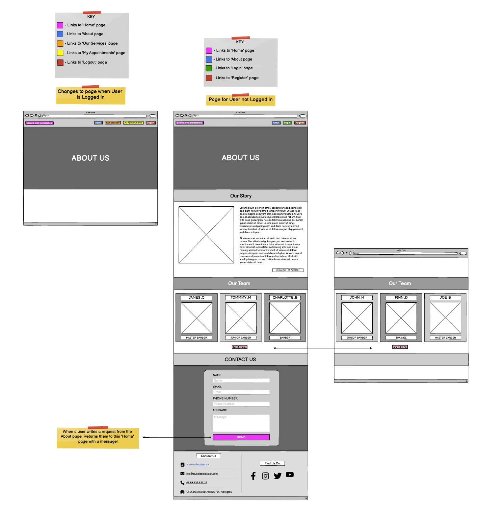

The design is consistent with the ‘home’ page. As well as this the sections of ‘Our story’, ‘Our team’ and ‘Contact Us’ are included on this page. Each of these aspects is data that the site admin can control. The ‘Our Story’ section contains an image, a body of text and an updated date. This can be updated by the admin whenever they want to update their story of the barbershop. ‘Our team’ section is a display of all the stylists that currently work at the barbershop. Each with their name, a profile image and job title. The number of stylists then can be paginated. The ‘Contact Us’ section is a form for the user to make a personalized request to the site owner.  

#### ‘Sign-In’, ‘Sign-up’ and ‘Sign-out’ pages

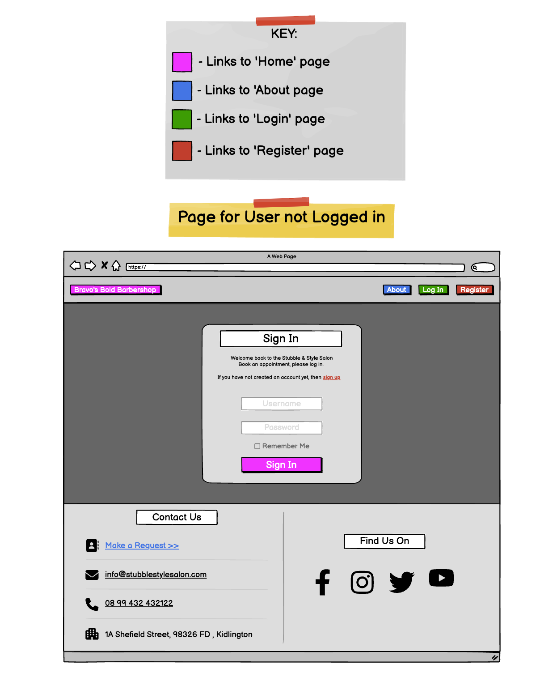

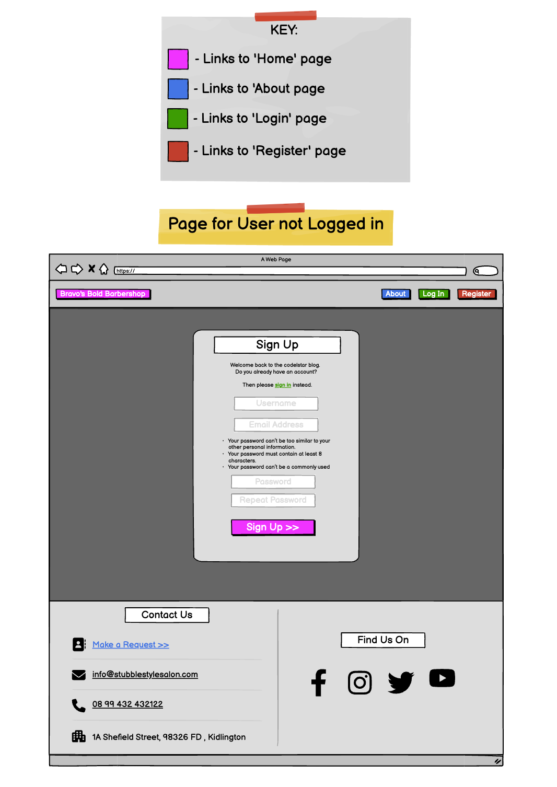

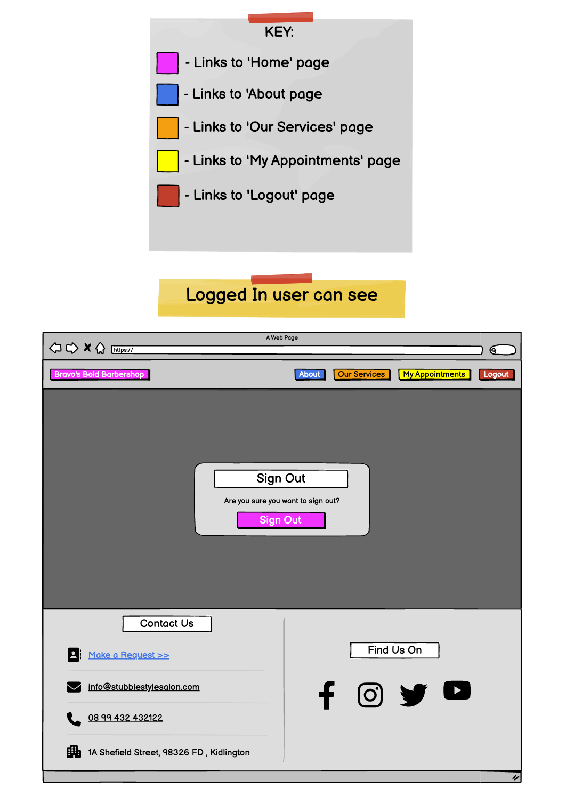

These three pages were designed to stay consistent with the style of the site, but also allow the user to make an account. This was designed with Django All-Auth in mind. 

#### ‘Our Services’ page

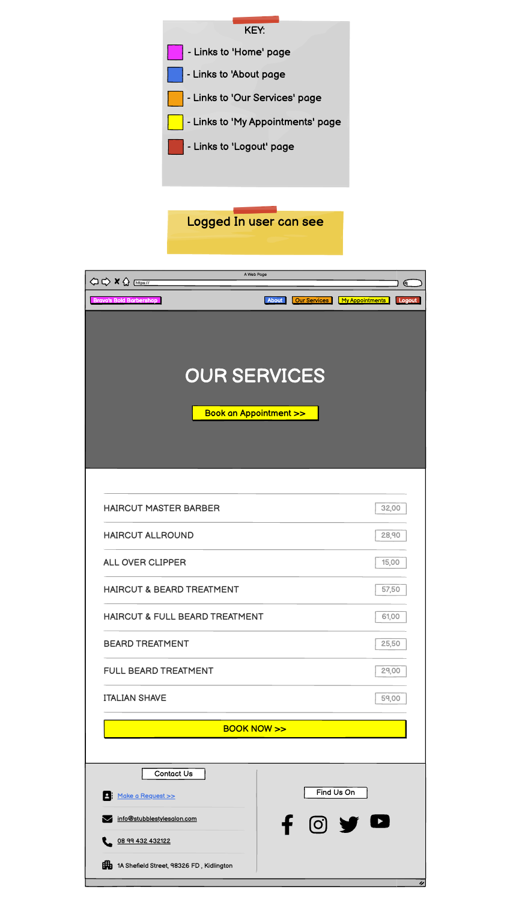

This page was designed exclusively for logged-in users and stays consistent with the look of the whole site. It displays a list of all the services the barbershop provides and the price of them. 

#### ‘My Appointments’ page

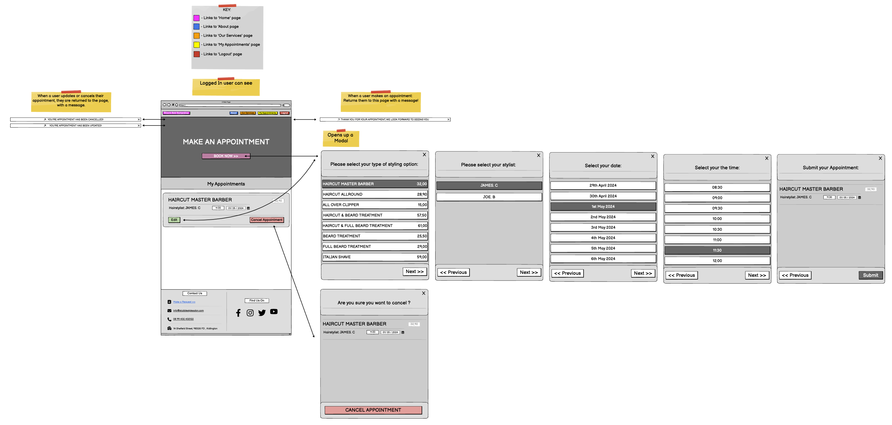

The final key aspect of the site is the ‘My Appointments’ page. It was designed to give the user full access to creating, reading, updating and deleting appointments. With the user of forms and modal. As well as messages indicating changes. Whilst also staying true to the site’s style.

For full access to the wireframe, this link will redirect to the Balsamiq workspace for [Bravo’s Bold Barbershop…](https://balsamiq.cloud/scq8ivf/pd49j2m/r2278)

### Entity Relationship diagrams

After the creation of the wireframe, it was time to map out the data of the site and how everything would connect. So the following ERD was created. Note; Changes were made to the models as the scope and complexity of the project changed.

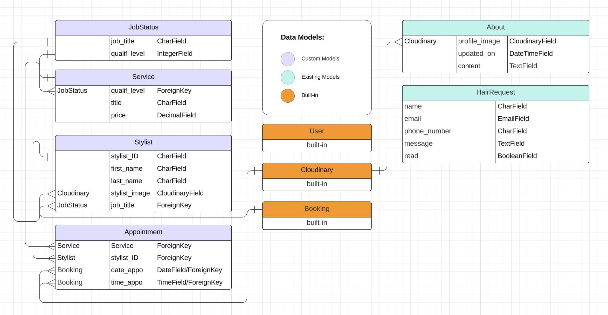

## Features

### Existing Features

The whole page is fully responsive thanks to the bootstrap built.

#### General Features

These aspects are found throughout the project. So the first thing is the style that is used throughout the site. 

Below is the image of the nav bar for a non-logged-in user! There is the first ‘Bravo’s Bold Barbershop’ which links to the home page. The others link to their particular page, ‘About’, ‘Register’, and ‘Login’ pages. This is used for clear and simple navigation for the user. 

The second image is the nav bar when the user is logged in, which has the same links as ‘home’, and ‘about’. Then three alterations: 'Our services’, ‘My Appointments’, and ‘Logout’. Which again links to their particular page. It should be noted that any links which redirect to the ‘My Appointments’ or ‘Our Services’ pages, will redirect non-logged-in to the sign-in page. This is to provide exclusive content for logged-in users.   

Below is the image of a masthead, this is consistent on all the pages, the only alteration is the title, for when on the ‘Home’ page will be ‘Bravo’s Bold Barbershop’ but on the ‘About’ page it will be ‘About Us’. However, each has the same quote underneath the title. In addition to this, the ‘make appointments’ button is consistent throughout the page. This is to ensure that the user can always go directly to make an appointment, log in or sign up! Like the links in the navbar if a user is not logged in this will redirect to the log-in page.

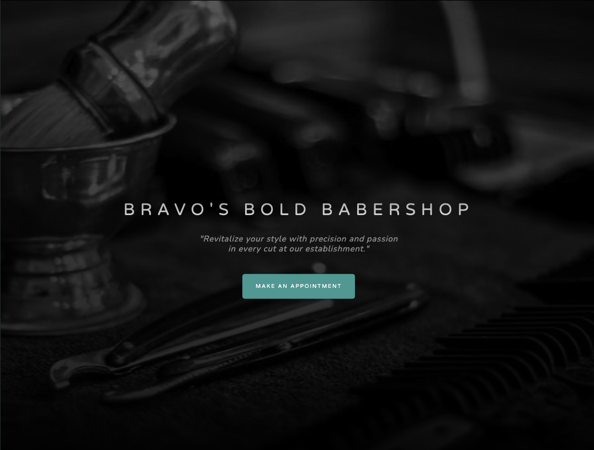

The footer is consistent throughout the page on every page for quick and easy access to contact information therefore the user can always access the contact information. As well as this the social media handles also boost popularity for the barbershop.

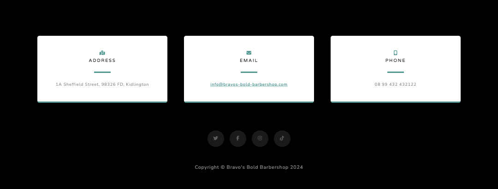

#### ‘Home’ page

On the ‘home’ page, there is the ‘Our Services’ section. Which displays two teaser services. Which provides the user with a little information about the barbershop’s services. On each is a link to the ‘Our services’ page, when non-logged-in users click this link they are redirected to the login page. This provides the user with a clear indication of what the barbershop can do for them. 

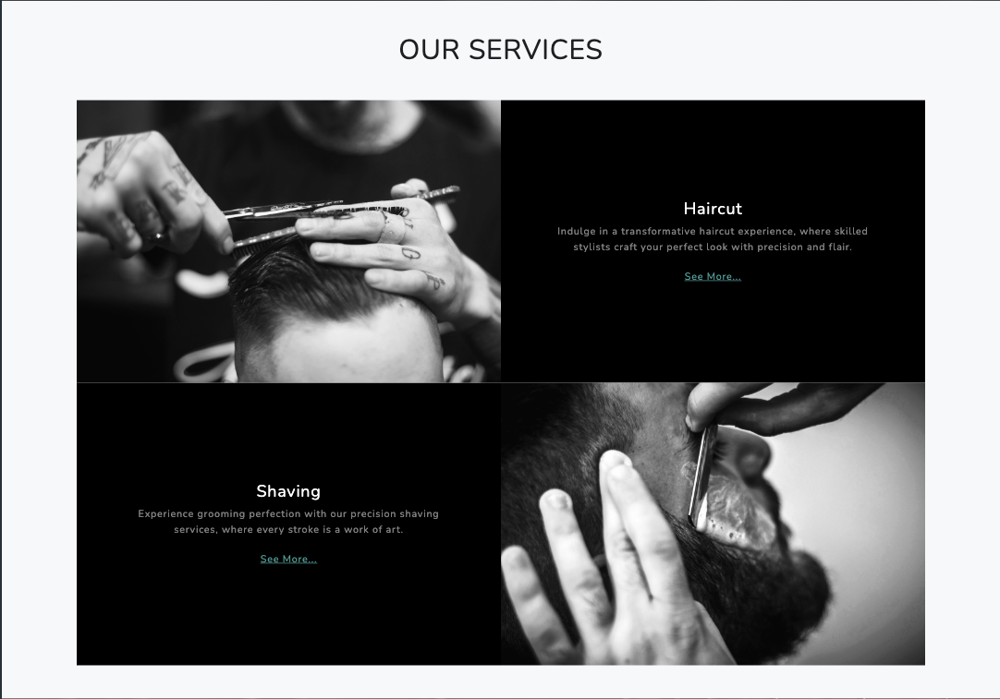

Underneath the ‘Services’ section is the opening time section which allows the user to see the hours of which the barbershop is open. This provides the user with clarity of when the potential time of their appointment could be.

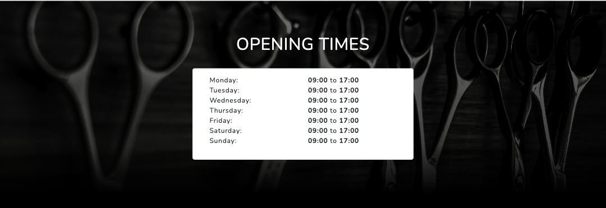

#### ‘About’ page

Underneath the masthead of the ‘About’ page is the ‘Our Story’ section. Which is populated with an image, a body of text and a date and time indicating when this section was last updated. This can be updated by the admin whenever they want and this would be reflected on the page. This provides the user with an understanding of the establishment. 

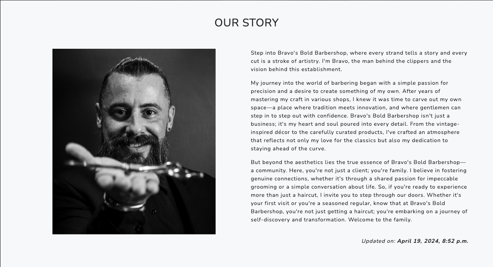

After the ‘Our Story’ section comes the ‘Our team’ section which uses the bootstraps built-in component of ‘Carousel’. This component displays certain elements on a rotation. Therefore every ‘Stylist’ created will display a card, with the stylist's ID name, profile image, job title and ‘book appointment’ button, which when clicked redirects to make appointments for logged-in users. Plus there are two buttons which can control the ‘Carousel’ from the next and previous slides. This provides the user with a clear representation of the people who work at the barbershop. 

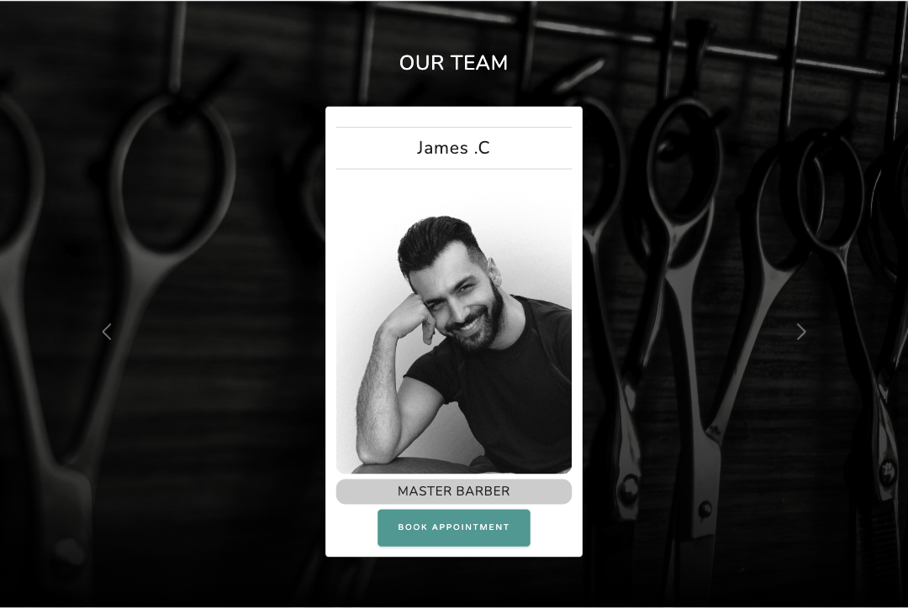

The final section on the ‘About’ page is the ‘Contact Us’ form. Which allows the user to create a personalized request to the site owner. All fields are required! When the submit button is clicked this then posts this request to the database and displays a success message which can be seen in the ‘messages’ section of this file. 

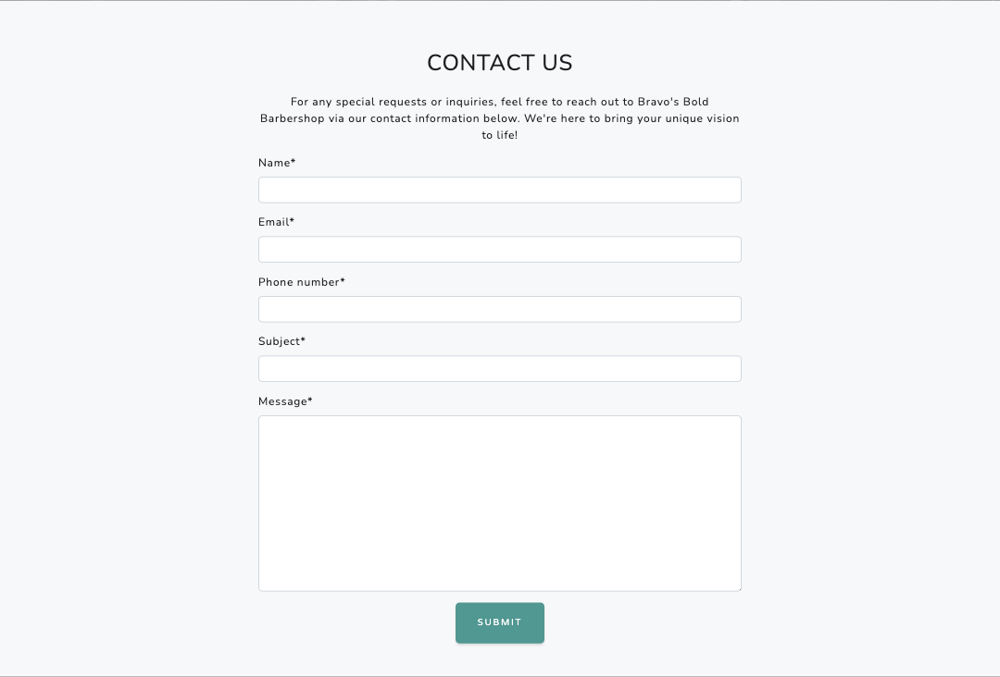

#### ‘Sign-in’, ‘Sign-up’ and ‘Sign-out’ pages

Using Allauth which is a Django add-on, enables the site to be able to create users and a login page, a register page and a logout page. These are consistent in the style of the site. This provides the user with the access and ability to create an account and have access to the exclusive pages for only logged-in users. 

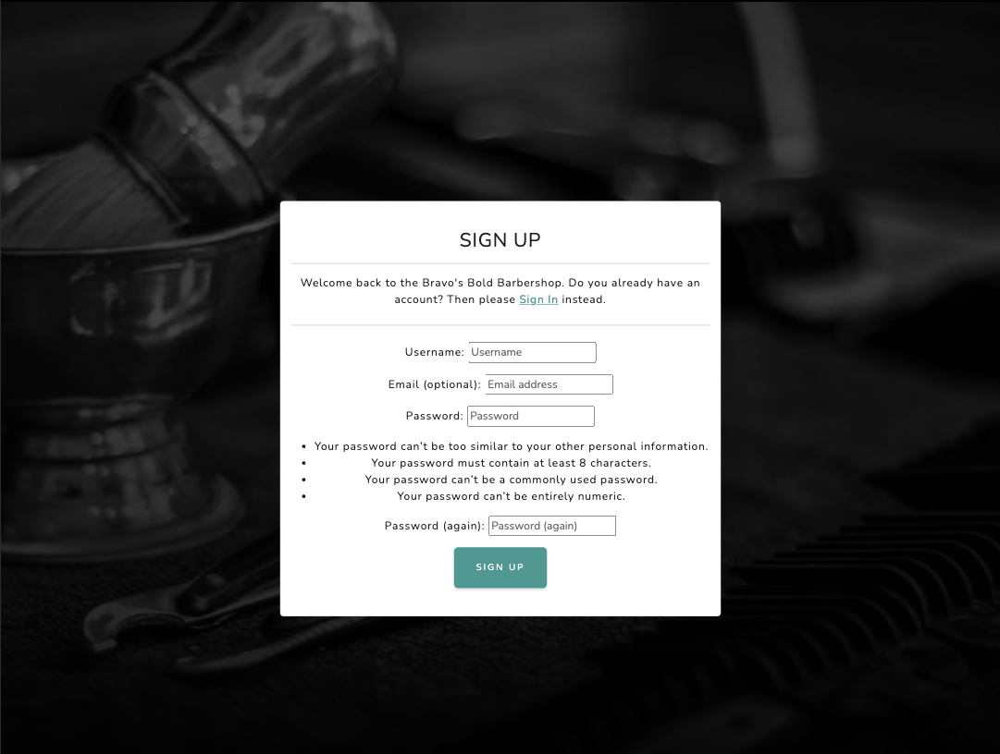
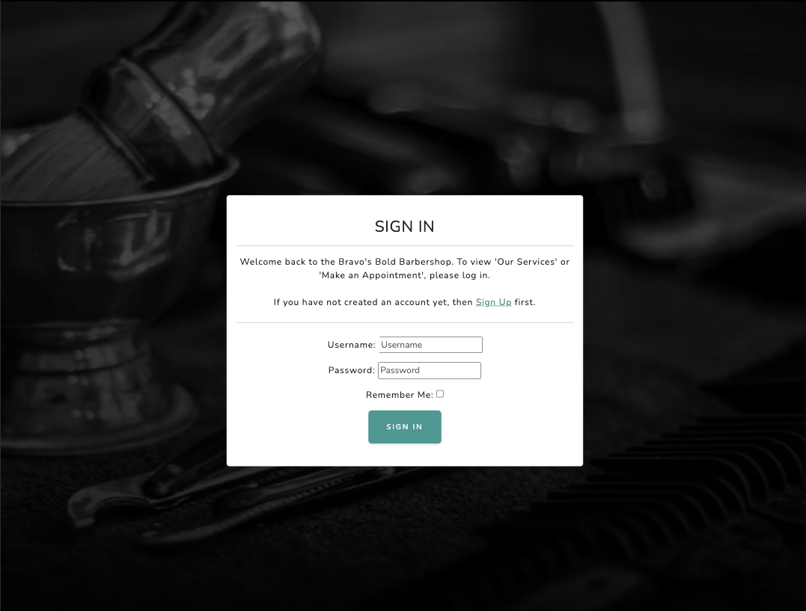
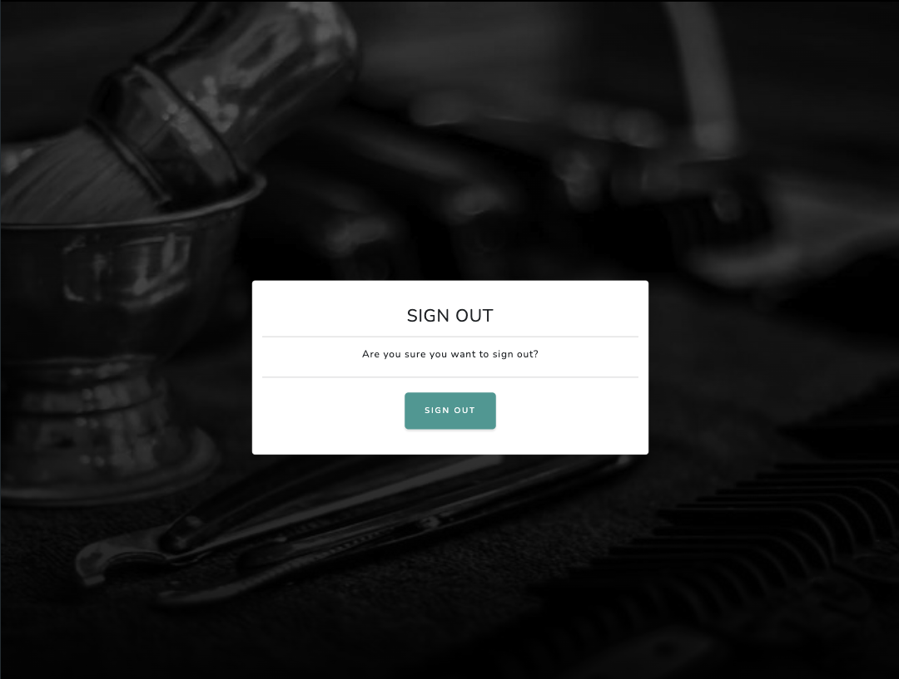

#### ‘Our Services’ page

When logged in a user can access the ‘Our services’ page which displays all the services the barbershop has to offer. It places each service in a list and populates each row with the title and the price of the service. At the end of the list is another button which when clicked will redirect the user to the ‘My appointments’ page like the other links do. This again helps the user constantly be able to reach the site owner's goal of making an appointment. 

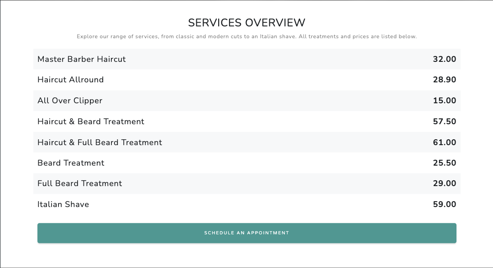

#### ‘My Appointments’ page

The main aspect of the whole site is the ‘My Appointments’ page, which the main component of this page is creating, reading, updating and deleting the user’s appointments. It has been written that only a logged-in user can create an appointment therefore when it comes to the site owner knowing who created the appointment it will be under the username created when making an account.

The first feature of this page is the masthead, which on this page has been altered. As usual, there is the title of the page to provide the user with clarity of where they are on the site. Underneath this title is a subtitle providing insight into where they can find their appointments when they are made. Then finally, the form feature. This feature contains four required entry fields; Service, a dropdown selection of the services the barbershop provides. Stylist, a dropdown selection of the stylist, of whom the user would want to cut their hair. Appointment time, which is a date picker created using the jQuery library. The field dates as such, yyyy/mm/dd, eg. 2024/05/19. Then finally is the appointment time field, which again is a dropdown selection of the times available made by the admin. ‘Service’, ‘Stylist ', and ‘Appointment Time’ are all foreign keys which are used in the rest of the site. All these fields and selections are determined by the site admin. Once submitted the user will have a success message the appointment can be found below the masthead.  

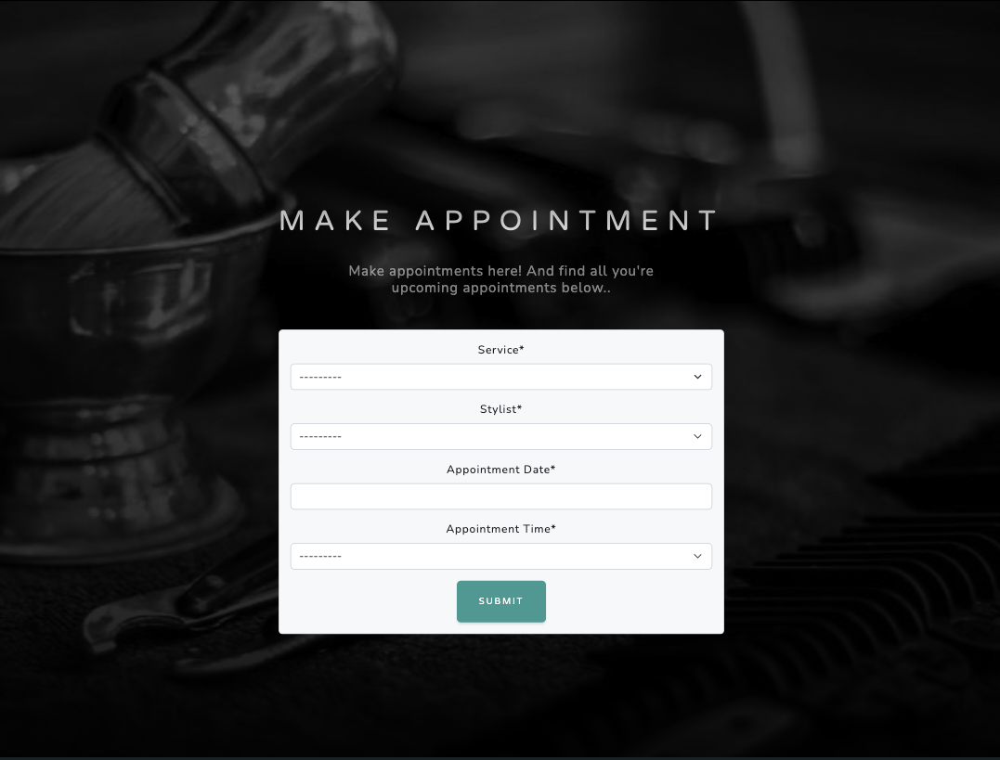

After the masthead comes the list of appointments made, the user can make as many appointments as they like and each will be displayed as the image below. In the card with the service as the title, the price, and all the other fields are boldly labeled. This provides the user with the ability to read their creation. At the end of the card are the ‘edit’ and ‘delete’ buttons, which both trigger a different response. This gives the user the ability to adjust and delete their appointments. This section is different to every user as it only displays the user’s appointments who is logged in.

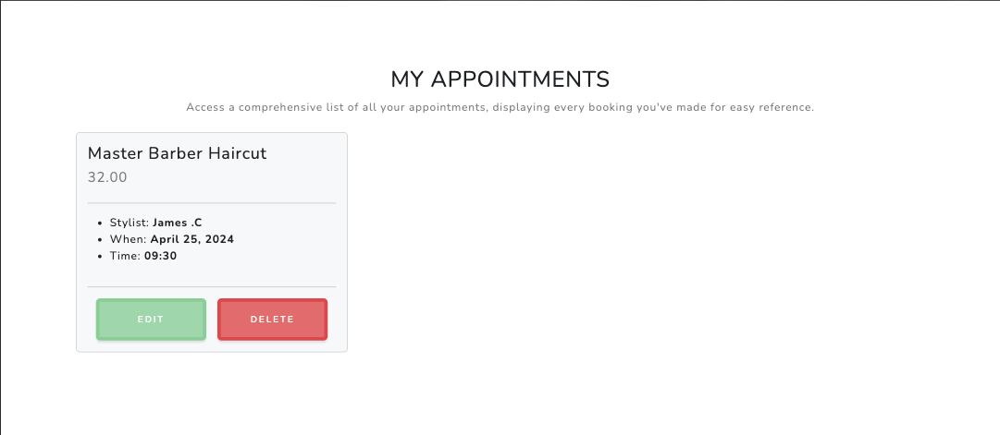

Defensive programming to ensure the user does not get confused when no appointments have been made. There will be a statement clearly stating that there are no appointments made by the user therefore there is nothing to list. This message then encourages the user to make a user of the form by providing a link which will scroll the user to the top of the page, where the form is located. This can be seen in the image below.

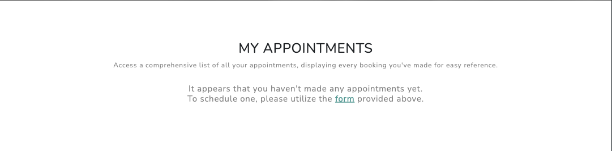

As mentioned, when the ‘edit’ button is clicked it will trigger the user to the form above, but pre-populate the fields with the selected appointment’s data points and the submit button becomes an update button. When each of the data points is adjusted to the user’s needs the update button can then be clicked and that particular appointment will be updated on the page and the database. The user will get confirmation that this change has happened with a message. This again provides the user with clear insight into the site has full control over their appointments, and is interactive.

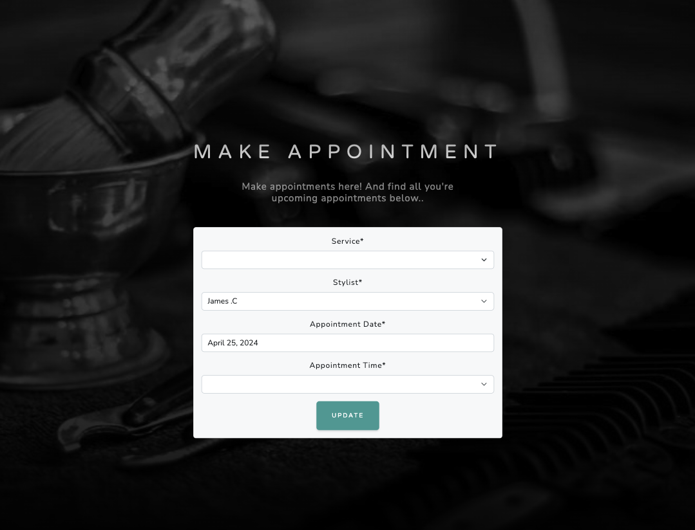

Lastly, the last feature is the delete button, which when clicked reveals a delete confirmation modal. This allows the user to consider their actions and deal with any mistake the user might make accidentally. Within the modal are the title, message, and two buttons, close, and delete. This modal in particular reveals the action which the user has made addressing, what happens when the deletion is made. If the user decides not to cancel, by pressing the ‘Close’ button this ends the modal. Then finally once the second delete button is clicked this will delete the appointment from the page and the database. The success message will be displayed at the top of the page clearly, declaring what just happened.

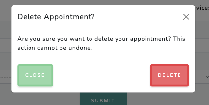

#### Messages

As mentioned throughout the list of features when a user makes particular choices on the page it will show a success message to clearly show the user what is going on, providing clarity for the user.

These three messages appear at the top of the ‘’My appointments’ page when a user creates, updates, and/or deletes an appointment.

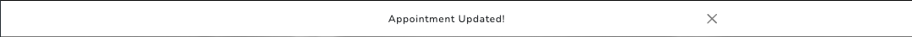
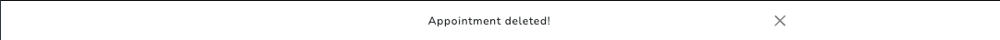

These two messages appear at the top of the ‘home’ page when a user either logs in or logs out.

This message appears at the top of the ‘About’ page when a user submits a hair request form.

### Features Left to implement

Regarding features left to implement, there are a few which would help make the site more realistic and better for the user, however, the scope of the project did narrow during the development. The list is as follows;

* Being able to book directly with the barber you wish - On the ‘about’ page where there are the cards on a carousel, it would be useful to be able to make an appointment with a particular stylist by clicking the book appointment under each of their cards and being directed to the form, where the name of the stylist is already pre-populated in the form.
* A forgot password option - To adjust to any information forgotten by the user enabling a better user experience.
* More information from users - Being able to request more information from a newly registered user to allow the site admin to have an overview of the person coming to the appointment. 
* The ability to book an appointment, with a particular service type - Like being able to book a certain stylist, I think the same should go for booking a service type. When a user selects a service on the ‘Our services’ page this is then prepopulated in the form found on the ‘My Appointments’ page. 
 * When creating an appointment, when selecting a certain service only some stylist can't perform that service for example, only a master barber can perform a ‘Master Barber haircut’, therefore only two barbers are being able to be selected. 
* When selecting a date for an appointment it can be limited to two months in advance, and let’s stay that some days the barbershop is closed.
* Avoid double bookings, when I user selects their fields this can’t then be done again because it is unavailable.
* The user can’t book an appointment in the past, and any appointment made when it pasts its date is then removed from the database and fades on the list of appointments for the user to see.
* Another aspect which could be added would be the fact of working days and working hours as a stylist.
* When a user edits their appointment, there's an option to cancel editing the appointment.
* When a user edits their appointment they can only change their stylist, date and time fields, and only up to 24 hours before the appointment time and date.

## Technologies Used

### Languages

* [HTML5](https://html.spec.whatwg.org/multipage/)  - Used to write the content of the site
* [CSS3](https://www.w3.org/TR/css-2022/)   - Used to style the site.
* [JavaScript](https://www.w3.org/TR/css-2022/)   - Used to create functionality for the site.
* [Python](https://www.python.org/) - Used to create and navigate the project.

### Frameworks
* [Django](https://www.djangoproject.com/) - Used to create project structure and utilities.
* [Bootstrap](https://getbootstrap.com/docs/5.3/getting-started/introduction/) - Used to have built-in stylisation and functionality.
* [jQuery](https://jquery.com/) - Used to access jquery's library.     

### Django Add-on Packages
* [Allauth](https://docs.allauth.org/en/latest/) - Used for account management
* [Crispy-Forms](https://django-crispy-forms.readthedocs.io/en/latest/install.html) - Used functionality and stylisation of the forms
* [Gunicorn](https://gunicorn.org/) - Used to deploy to Heroku
* [Sumernote](https://pypi.org/project/django-summernote/) - Used for stylisation to admin panel
* [Whitenoise](https://whitenoise.readthedocs.io/en/latest/) - Used for collecting static files

### Databases
* [Cloudinary](https://cloudinary.com/) - Used for storing uploaded images by admin
* [PostgreSQL](https://en.wikipedia.org/wiki/PostgreSQL) - Used for the application database
* [ElephantSQL](https://www.elephantsql.com/) - Used as PostgreSQL database service

### Development
* [Git](https://git-scm.com/) - Used for version control
* [Gitpod Template](https://github.com/Code-Institute-Org/gitpod-full-p3) - Used to create a workspace, provided by Code Institute!
* [Gitpod](https://www.gitpod.io/) - Used IDE to create a project
* [Github](https://github.com/) - Used for hosting repository 
* [Heroku](https://www.heroku.com/home) - Used to deploy the site.

### Planning
* [Balsamiq](https://balsamiq.com/) - Used to create a wireframe to design a project
* [LucidChart](https://www.lucidchart.com/) - Used to create ERD 

### Testing
* [HTML Validator](https://validator.w3.org/)   -Used to check and validate the HTML code used in the site.
* [CSS Validator](https://jigsaw.w3.org/css-validator/) -Used to check and validate the CSS code used in the site.
* [JavaScript Validator](https://jshint.com//) - Used to check and validate the JavaScript code used in the site.
* [Python Validator](https://pep8ci.herokuapp.com/) - Used to check and validate the Python code used in the site.
* [Google Lighthouse](https://chromewebstore.google.com/detail/lighthouse/blipmdconlkpinefehnmjammfjpmpbjk?hl=de) - Used to check and the performance and accessibility of the site.

### Others
* [Grayscale](https://startbootstrap.com/theme/grayscale) - Used as a template theme.
* [Am I Responsive](https://ui.dev/amiresponsive) - A site used to test the responsiveness of the page.
* [FontAwesome](https://fontawesome.com/)   - Linked for all icons used on the site
* [Google Fonts](https://fonts.google.com/) - Source of the site’s fonts.
* [Favicon Generator](https://realfavicongenerator.net/) - Used to generate favicon files.
* [Pexels](https://www.pexels.com/) - Used for stocked images.

## Testing

### Automated Testing

### Manual Testing

### Validator Testing

### Accessibility 

### Bugs

#### Fixed Bugs

#### Unfixed Bugs

## Deployment

## Credits

### Content

### Media

